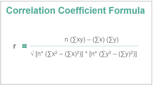
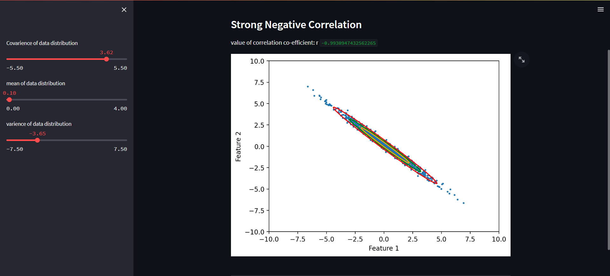
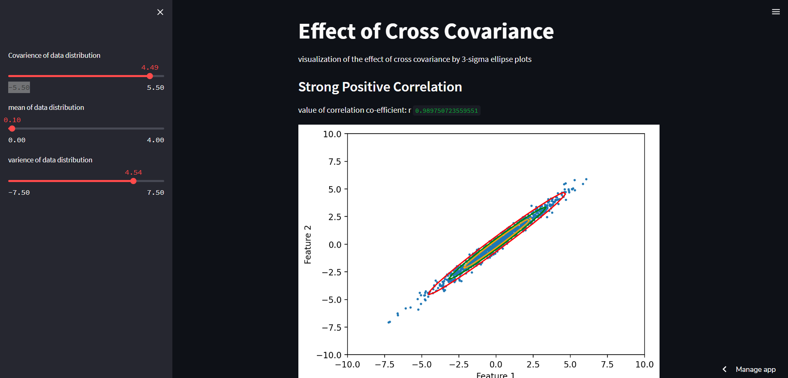
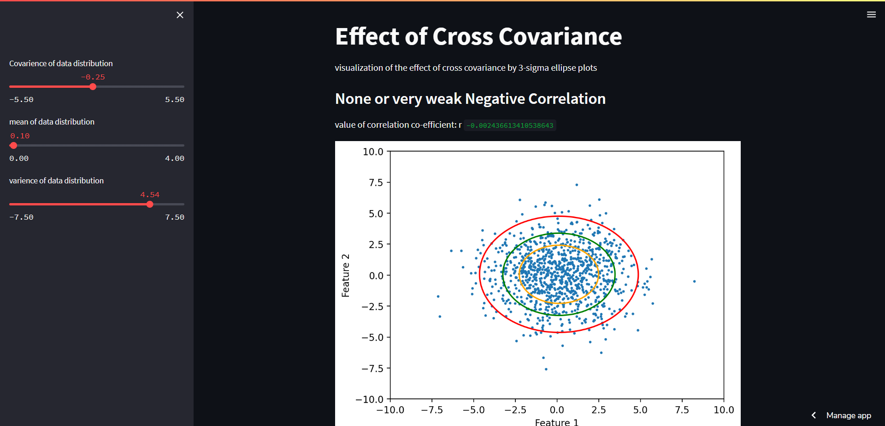

# Assignment-3

## Problem Statement:

Create a dataset of two features and visualize the effect of cross covariance by plotting the 3 sigma ellipse plots and plot the samples from the distribution of data.

## link

https://goalpooja-assignment-3-pooja-pinki-file-7xmop5.streamlit.app/#strong-positive-correlation

## data creation:

       data = np.random.multivariate_normal(mean, cov, 1000)

 the multivariate normal distribution, multivariate Gaussian distribution, or joint normal distribution is a generalization of the one-dimensional (univariate) normal distribution to higher dimensions. 

 

 ### cov matrix:
    

## Sliders:
Slider 1:
 
                Covarience of data distribution

Covarience of data distribution x and y.

Slider 2:

mean of data distribution

Slider 3:

varience of data distribution

## value of correlation co-efficient: r:

Correlation coefficient formulas are used to find how strong a relationship is between data. The formulas return a value between -1 and 1, where:

1 indicates a strong positive relationship.
-1 indicates a strong negative relationship.
A result of zero indicates no relationship at all.

There is a rule of thumb for interpreting the strength of a relationship based
on its r value (use the absolute value of the r value to make all values
positive):

|Absolute Value of r|Strength of Relationship|
|-------------------|------------------------|
|r < 0.3|None or very weak|
|0.3 < r <0.5|Weak|
|0.5 < r < 0.7|Moderate|
|r > 0.7|Strong|

## sample:

## Instruction to run file:

comment:

                    streamlit rum filename.py

## Reference:

https://www.westga.edu/academics/research/vrc/assets/docs/scatterplots_and_correlation_notes.pdf

https://en.wikipedia.org/wiki/Multivariate_normal_distribution

https://streamlit.io/

